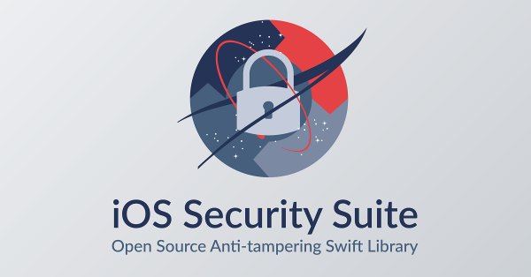

<p align="center">
    
</p>

<h1 align="center">SecuritySuite</h1>

<p align="center">

<br>
<br>
    </a>
    <a href="https://github.com/epitonium/SecuritySuite/blob/main/LICENSE" alt="License">
        </a>    
</p>

## Description

iOS platform security & anti-tampering Swift library. Refactored version of the [IOSSecuritySuite](https://github.com/securing/IOSSecuritySuite) by [securing](https://github.com/securing).

## Integration

Use `Swift Package Manager` to integrate.

## Usage

```swift
// Setup.
SecuritySuite.setup(isJailBrokenCheckEnabled: true,
                    isDebuggerCheckEnabled: true,
                    isEmulatorCheckEnabled: true,
                    isReverseEngineeringCheckEnabled: true)

// Get security check result.
// If the first true condition check was met the later checks are stopped.
switch SecuritySuite.checkSecurityIssues() {
case .succes:
    // Proceed to app
case .failure(let securityError):
    // Present cannot proceed scene
}
```

## License

`SecuritySuite` is distributed under the terms and conditions of the [MIT license](https://github.com/epitonium/SecuritySuite/blob/main/LICENSE).